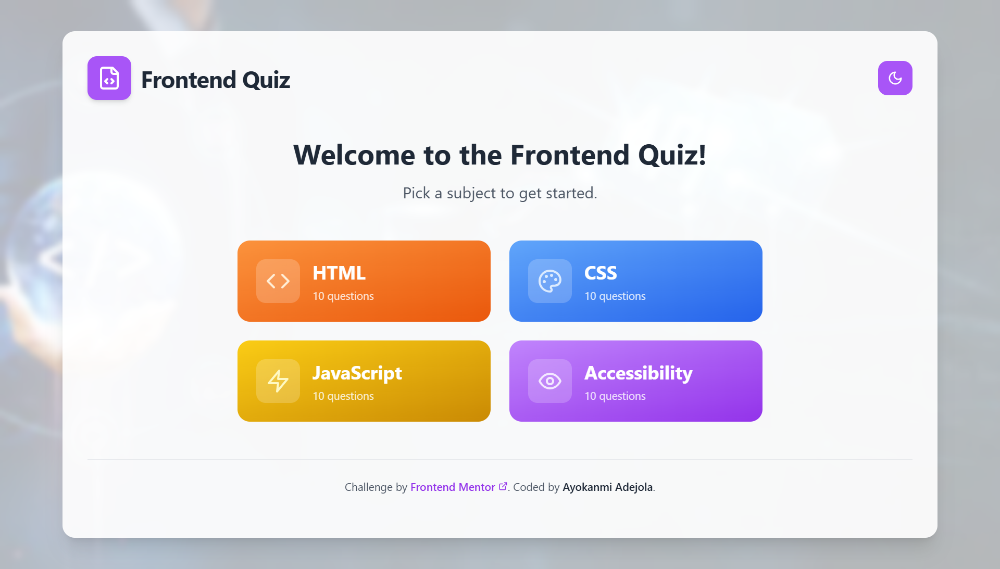

# Frontend Quiz App

A beautiful, fully-featured quiz application built with React, TypeScript, and Tailwind CSS. Test your frontend development knowledge across HTML, CSS, JavaScript, and Accessibility topics.



## 🌟 Features

- **Multiple Quiz Topics**: HTML, CSS, JavaScript, and Accessibility
- **Interactive Questions**: Single-answer selection with immediate feedback
- **Real-time Scoring**: Track your progress throughout the quiz
- **Error Handling**: Validation for incomplete submissions
- **Responsive Design**: Optimized for mobile, tablet, and desktop
- **Theme Toggle**: Switch between light and dark modes
- **Accessibility**: Full keyboard navigation and screen reader support
- **Smooth Animations**: Polished transitions and micro-interactions
- **Play Again**: Restart with different subjects


## 🛠️ Built With

- **React 18** - Modern React with hooks
- **TypeScript** - Type-safe development
- **Tailwind CSS** - Utility-first CSS framework
- **Vite** - Fast build tool and dev server
- **Lucide React** - Beautiful icons

## 📱 Screenshots

### Desktop View
- Clean, modern interface with gradient backgrounds
- Color-coded subject cards for easy navigation
- Progress indicators and visual feedback

### Mobile View
- Fully responsive design
- Touch-friendly interactions
- Optimized layout for smaller screens

## 🎯 Challenge Requirements

This project fulfills all Frontend Mentor challenge requirements:

- ✅ Select a quiz subject
- ✅ Select a single answer from multiple choices
- ✅ Error message for incomplete submissions
- ✅ Immediate feedback on correct/incorrect answers
- ✅ Progress through questions automatically
- ✅ Final score display with completion state
- ✅ Play again functionality
- ✅ Responsive design for all devices
- ✅ Hover and focus states for interactive elements
- ✅ Full keyboard navigation support
- ✅ Light/dark theme toggle (bonus feature)

## 🏗️ Installation & Setup

1. **Clone the repository**
   ```bash
   git clone https://github.com/yourusername/frontend-quiz-app.git
   cd frontend-quiz-app
   ```

2. **Install dependencies**
   ```bash
   npm install
   ```

3. **Start the development server**
   ```bash
   npm run dev
   ```

4. **Open your browser**
   Navigate to `http://localhost:5173`

## 📁 Project Structure

```
src/
├── components/          # Reusable UI components
│   ├── Attribution.tsx  # Frontend Mentor attribution
│   ├── QuestionCard.tsx # Quiz question interface
│   ├── ResultsScreen.tsx# Final score display
│   ├── SubjectCard.tsx  # Subject selection cards
│   └── ThemeToggle.tsx  # Light/dark mode toggle
├── data/
│   └── quiz-data.json   # Quiz questions and answers
├── hooks/               # Custom React hooks
│   ├── useQuizData.ts   # Quiz data management
│   └── useTheme.ts      # Theme state management
├── types/
│   └── quiz.ts          # TypeScript type definitions
├── App.tsx              # Main application component
├── main.tsx             # Application entry point
└── index.css            # Global styles
```

## 🎨 Design System

### Colors
- **Primary**: Purple gradient (`from-purple-400 to-purple-600`)
- **HTML**: Orange (`from-orange-400 to-orange-600`)
- **CSS**: Blue (`from-blue-400 to-blue-600`)
- **JavaScript**: Yellow (`from-yellow-400 to-yellow-600`)
- **Accessibility**: Purple (`from-purple-400 to-purple-600`)

### Typography
- **Headings**: Bold, hierarchical sizing
- **Body**: Clean, readable font with proper line spacing
- **Interactive**: Clear focus states and hover effects

### Spacing
- Consistent 8px grid system
- Generous padding and margins for readability
- Responsive breakpoints for all screen sizes

## 🧪 Quiz Content

### HTML (10 Questions)
- Basic HTML structure and semantics
- Elements, attributes, and best practices
- Modern HTML5 features

### CSS (10 Questions)
- Styling fundamentals and syntax
- Selectors, properties, and values
- Layout and positioning techniques

### JavaScript (10 Questions)
- Core language concepts and syntax
- Functions, variables, and data types
- DOM manipulation and events

### Accessibility (10 Questions)
- WCAG guidelines and standards
- ARIA attributes and roles
- Inclusive design principles

## 🎮 How to Play

1. **Choose a Subject**: Select from HTML, CSS, JavaScript, or Accessibility
2. **Answer Questions**: Click on your chosen answer for each question
3. **Get Feedback**: See immediate results for correct/incorrect answers
4. **Track Progress**: Monitor your advancement through the quiz
5. **View Results**: See your final score and performance summary
6. **Play Again**: Choose a different subject or retake the same quiz

## 🔧 Available Scripts

- `npm run dev` - Start development server
- `npm run build` - Build for production
- `npm run preview` - Preview production build
- `npm run lint` - Run ESLint

## 🌐 Browser Support

- Chrome (latest)
- Firefox (latest)
- Safari (latest)
- Edge (latest)

## 📈 Performance Features

- **Lazy Loading**: Efficient resource loading
- **Optimized Images**: Compressed and responsive images
- **Fast Rendering**: Vite's optimized build process
- **Minimal Bundle**: Tree-shaking and code splitting

## ♿ Accessibility Features

- **Keyboard Navigation**: Full app navigation without mouse
- **Screen Reader Support**: Proper ARIA labels and roles
- **High Contrast**: WCAG AA compliant color ratios
- **Focus Management**: Clear focus indicators
- **Semantic HTML**: Proper heading structure and landmarks


## 🙏 Acknowledgments

- **Challenge by**: [Frontend Mentor](https://www.frontendmentor.io)
- **Icons**: [Lucide React](https://lucide.dev)
- **Images**: [Unsplash](https://unsplash.com)

## Author

- Frontend Mentor - [@Ayokanmi-Adejola](https://www.frontendmentor.io/profile/Ayokanmi-Adejola)

